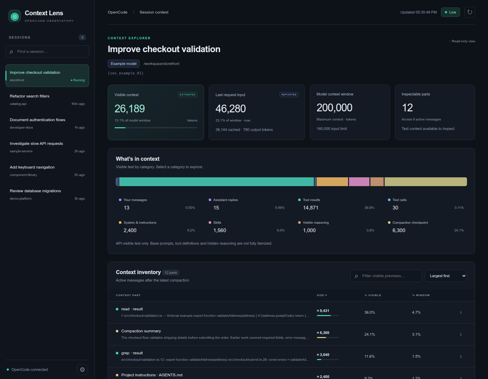

# OpenCode Context Lens

A local, interactive dashboard for **OpenCode V2** sessions: active context parts,
estimated tokens and percentages, provider-reported request usage, session search,
category filtering, and a full-text inspector. Refreshes automatically; polling can
be paused. Session links can be bookmarked.



*Example interface with entirely fictional sessions, paths, and message content.*

## Run

Requires Python 3.11+, [uv](https://docs.astral.sh/uv/), and OpenCode V2.

```sh
./run.sh
```

The script installs dependencies through `uv` and starts the server. It also works
when invoked from another directory.

Open **http://127.0.0.1:9193**. The port defaults to **9193** and is configurable via
`port` in `settings.yaml`; restart the server after changing it.

The dashboard reads OpenCode through its authenticated
`opencode api` command, using the same managed service as the CLI. OpenCode may start
its service automatically. The viewer does not modify sessions or read the database.

## Settings

Copy `settings.example.yaml` to `settings.yaml` for local overrides, then restart.
Local settings are ignored by Git; defaults apply when the file is absent.

```yaml
opencode_path: null                  # PATH, then ~/.opencode/bin/opencode
opencode_server: null                # Optional explicit HTTP(S) server
host: 127.0.0.1
port: 9193                          # Configurable dashboard port
refresh_seconds: 5
request_timeout_seconds: 30
```

`opencode_path` accepts an executable, a `bin` directory, or an installation directory
(for example `~/.opencode`). Relative paths resolve beside the settings file. If the
file is absent, defaults apply. Use another file with
`./run.sh --settings /path/to/settings.yaml`.

## Reading the numbers

- **Visible context:** text from the active-context API, including retained
  compaction summaries, messages, tool calls/results, skills and visible reasoning.
  Per-part token sizes use `o200k_base` as an estimate for every model. Percentages
  show share of visible text and share of the model’s context window.
- **Last request input:** provider-reported uncached input + cache reads + cache
  writes for the latest completed assistant request in active context. This is
  a previous request’s measurement, not cumulative session usage or a live total.
- **Visibility limits:** the API does not itemize the base system prompt, tool
  definitions, protocol overhead, media tokens or encrypted reasoning. These are
  not fabricated as text tokens. Unknown sizes are marked explicitly. The visible
  estimate and reported request total have different scopes and may differ.
- The tokenizer downloads its encoding on first use and caches it locally. If
  unavailable, the UI identifies the fallback UTF-8-bytes/4 estimate. Model limits
  are read from OpenCode; unavailable limits are shown as unknown.

Context summaries are cached for one refresh interval, for up to eight sessions.
Full part content is loaded into the browser only when inspected. An open inspector
keeps its original snapshot while monitoring continues.

## Checks

```sh
uv run pytest
uv run ruff check .
```
